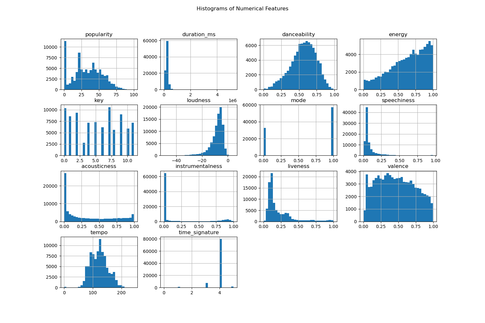
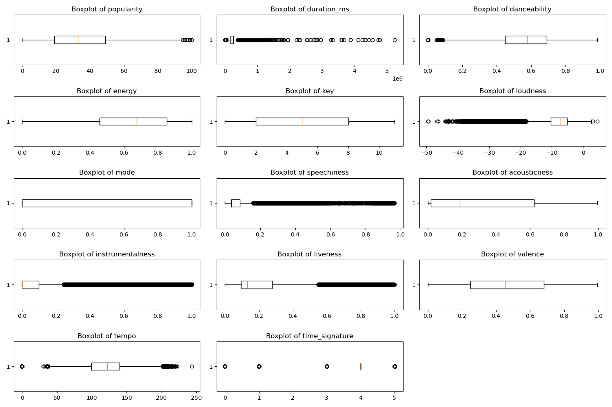
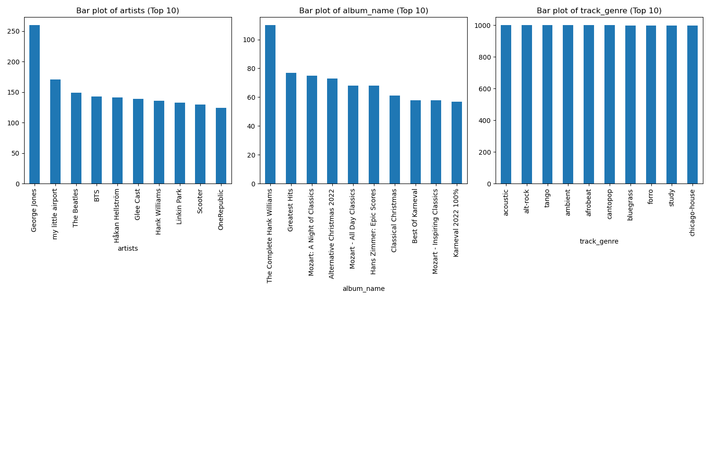
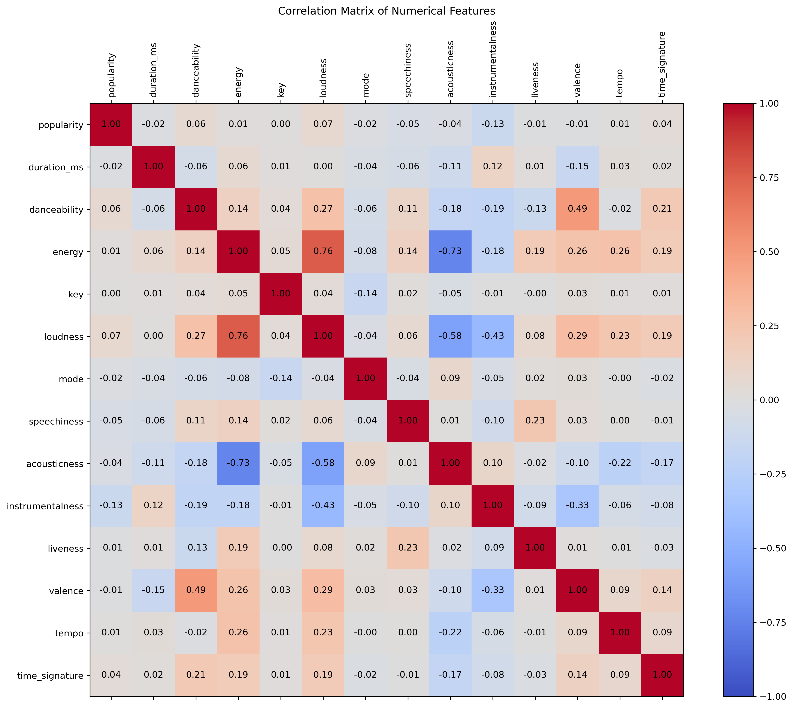
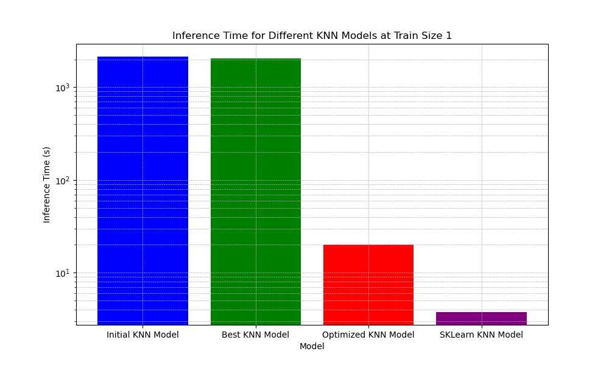
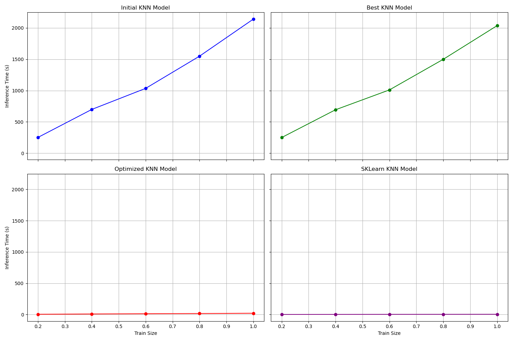
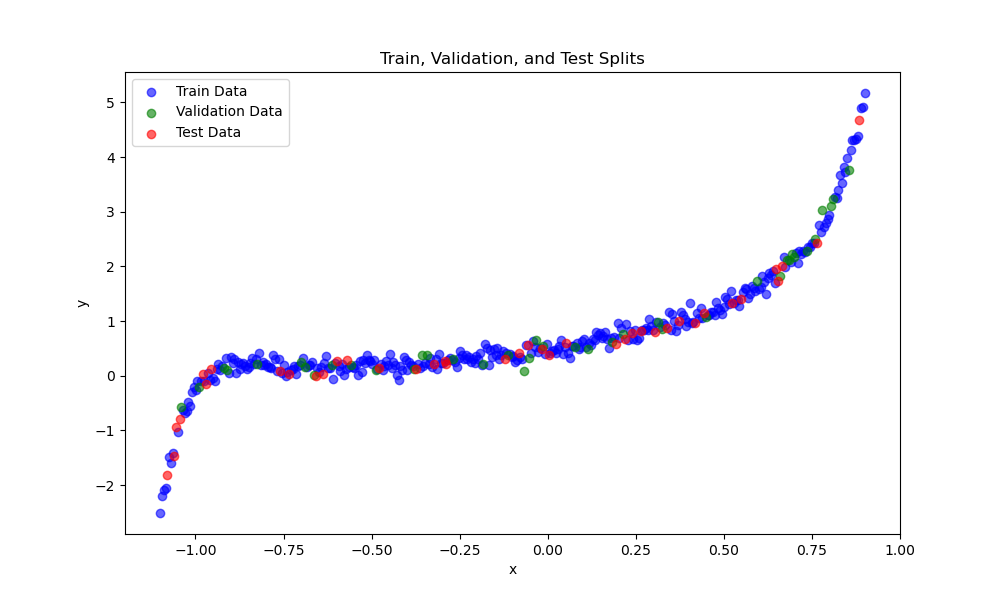
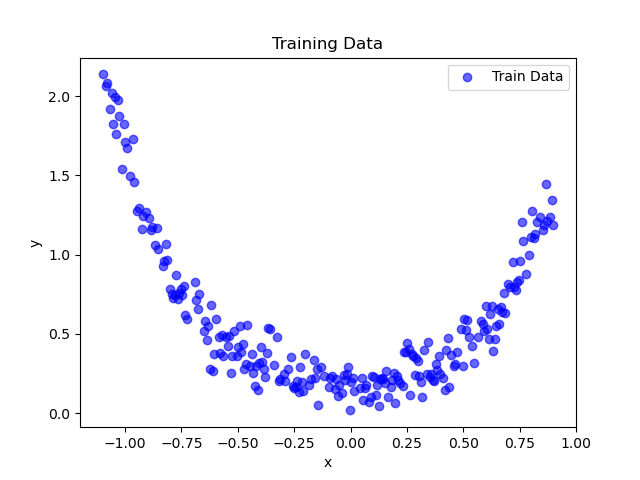

# Assignment 1 Report

## KNN Exploratory Data Analysis:

### Histogram:

<!--  -->

We can see that except some features all are skewed. Hence we need to normalize these features.

### Box plots for numeric value features:

<!--  -->

We can see outliers for various features such as danceability, tempo, popularity. 

### Bar plots for categorical value features:

<!--  -->

Top 10 categories are plotted which give idea about how popular these categories are

### Correlaation Matrix:

<!--  -->

few features seem to be highly correlated such as "energy-loudness", "danceablty-valence". Few are highly un-correlated such as "acousticness-loudness", "acousticness-energy".

### Hierarchy:

Based on all these different data visualizations, I think popularity, danceability, loudness, energy seem to be more necessary than others.

## Hyperparameter Tuning:

### Best k, distance metric:

Best (k, distance_metric) pair is (1, 'manhattan') with validation accuracy: 0.3111. 

### Top 10 (k, distance_metric) pairs by validation accuracy:

1: k=1, distance_metric=manhattan, accuracy=0.3111
2: k=17, distance_metric=manhattan, accuracy=0.3054
3: k=21, distance_metric=manhattan, accuracy=0.3053
4: k=13, distance_metric=manhattan, accuracy=0.3010
5: k=9, distance_metric=manhattan, accuracy=0.2985
6: k=5, distance_metric=manhattan, accuracy=0.2922
7: k=1, distance_metric=cosine, accuracy=0.2860
8: k=1, distance_metric=euclidean, accuracy=0.2846
9: k=3, distance_metric=manhattan, accuracy=0.2764
10: k=9, distance_metric=cosine, accuracy=0.2723

### Dropping various columns:

('key', 'mode') is the feature subset dropping  which gave best accuracy: 0.3274. 

## Optimization:

<!--  -->

Train size(fraction)

[ 0.2, 0.4, 0.6, 0.8, 1]

Inference times 

Initial model : 2141.7567 s

[ 251.0111, 698.3058, 1034.7844, 1549.2609 , 2141.7567 ]

Best Model : 2037.0937 s

[ 249.2745, 693.0538, 1009.8664, 1498.9563 , 2037.0937 ]

Optimized model: 20.2083 s

[ 3.9232 , 8.4679, 12.1807 , 15.6675, 20.2083]

SKLearn: 3.7695 s

[  1.2999 , 1.9799, 2.7296, 3.0184 ,3.7695]

<!--  -->

### Observation:

For Initial model and best model executions times are so high as code used was not optimized. For Optimized code model execution time is significantly reduxed as comared to previous code. SKlearn model has least execution times but optimized model is very close to it. For Initial and best model execution time goes on increasing almost linaerly with training size. For optimized and SKlearn it increases but not that significantly. 

## Second Dataset:

Almost similar performance was observed.

## Linear Regression:

All the metrics which to be reported are printed when code is run. Also all the plots are plotted at run time.  All GIFs are stored in figures folder.

### 3.1

### 3.1.1

### 3.1.2

k that minimizes error on the test set is printed when code is run it varies a bit so not stated in report.

### 3.1.2
Animations:

 

### 3.2 

### 3.2.1

Even if results vary, I observe that L1 regularazation gives lower degree polynomial to be best as comapred to L2. This may be becaue L1 regularization penalizes even by putting 0 weight but L2 regularization even though penalizes heavily but not 0. 

## Note:

In a1.py since entire code which was not run in one go is combined some functions such as data_cleaning(), are just made to not run code inside it while showing assignment. But code inside that was used once for cleaning. Similar;y for hyper parameter tuning anf finding best column subset. In knn.py unoptimized version of KNN class is commented only new version is un commented code which will be used while running. Some libraries which were not allowed are imported because in some tasks such as getting inference time for sklearn they were needed, Those libraries were used only for such cases and nowhere in other code.

### Citing resources:

Data cleaning code and read write , plot codes are taken from chatGPT.
In KNN class structure was taken from chatGPT. F1-score, precision, recall functions taken from chatGPT. Entire optimized version of KNN class is traken from chatGPT.
In Linear regression, initial code(degree = 1) was written by some code for degree>1 is taken from chatGPT. saveGIF() function is entirely taken from chatGPT.
