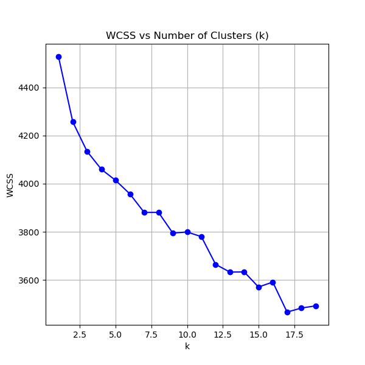
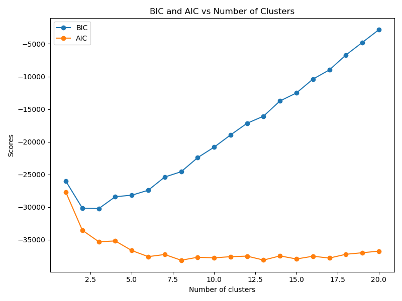
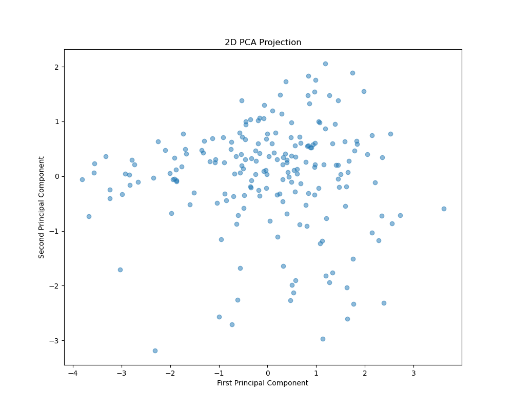
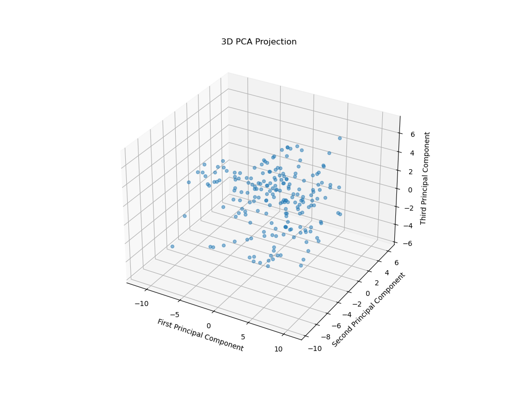
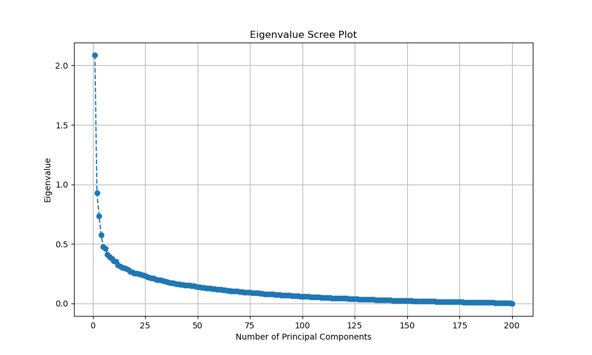
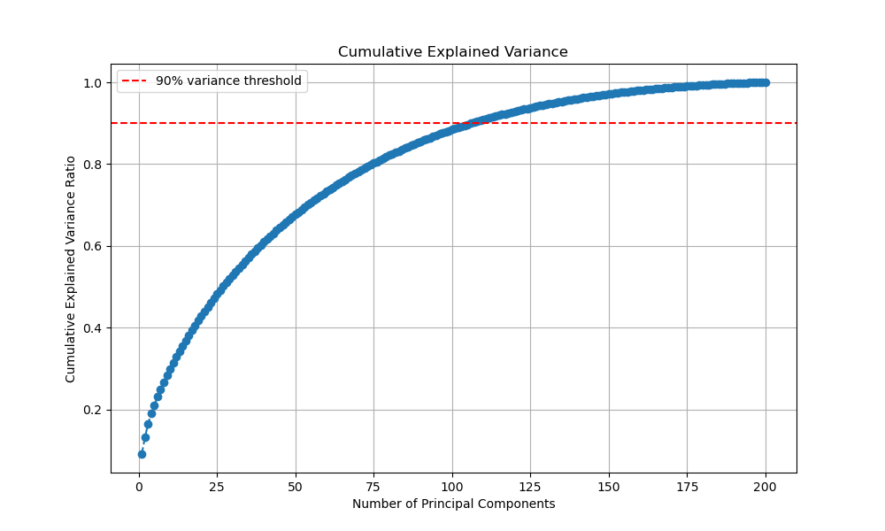
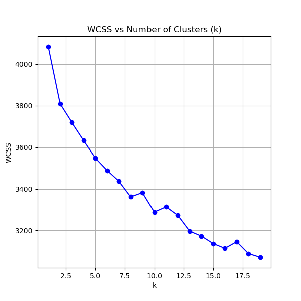
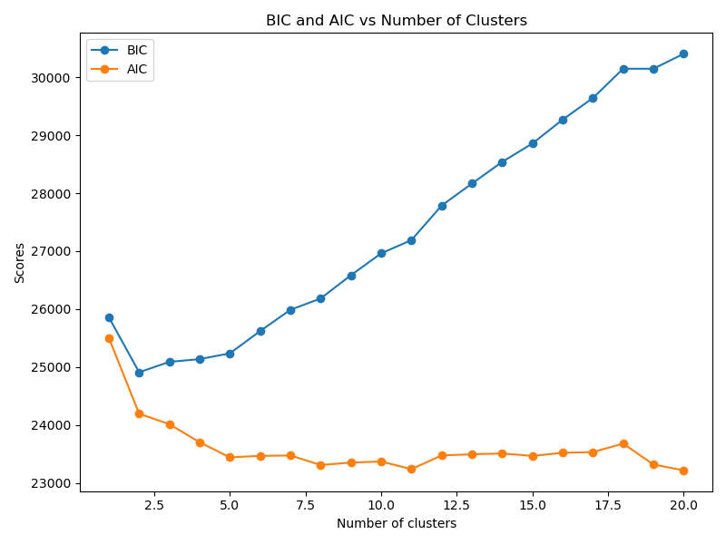
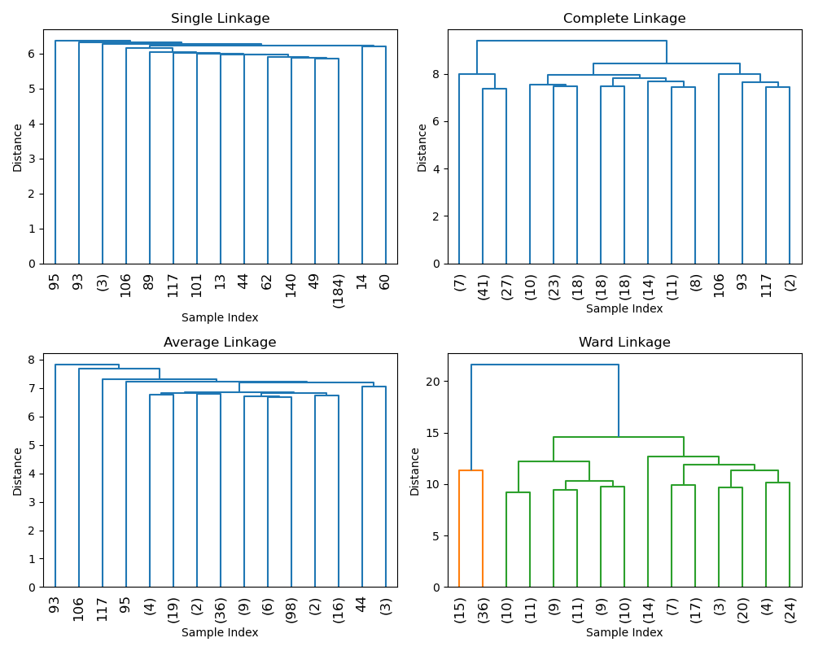
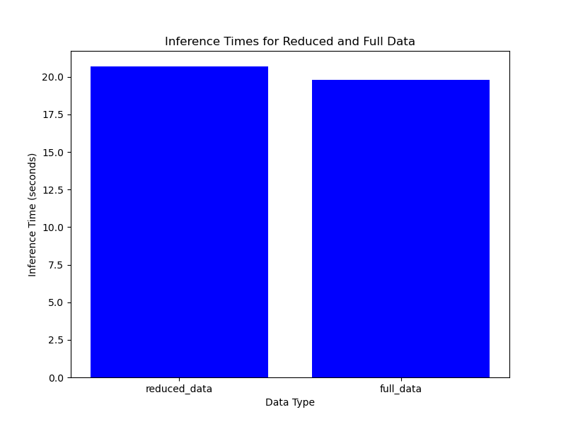

# 3
# K-means:
Initial means should be randomly picked from data samples(X). Otherwise it doesn't work.

From above elbow plot k = 12 looks like a elbow point which is suitable. The plot we have got is shaky because k-means is not that effective on this very high dimension dataset it seems. So we are not getting very distinct and clear elbow point in the plot but still 12 somewhat looks like a good elbow point.

### kkmeans1 = 12 

# 4
# GMM:

## Issues with Custom GMM Implementation

I have tried to address all of the following issues in code so code does work. But for higher dimensions I am getting runtime warnings and log likelihood as infinite. 

The custom Gaussian Mixture Model (GMM) implementation faces several issues leading to runtime warnings and incorrect log-likelihood values:

### 1. Numerical Instabilities
- **Overflow in Exponentiation:** Large values from exponentiation can cause numerical instability.
- **Log of Zero:** Logarithm of zero leads to `-inf`, affecting subsequent calculations.

### 2. Covariance Matrix Problems
- **Positive Definiteness:** Covariance matrices must be positive definite. Inadequate regularization can cause instability.
- **Regularization Issues:** Insufficient regularization may not fully resolve matrix singularity problems.

### 3. Division by Zero
- **Normalization Issues:** Division by zero during responsibility normalization can lead to `NaN` or `Inf` values.

### 4. Handling Numerical Errors
- **Inadequate Error Handling:** Catching and setting zero probabilities without addressing underlying issues may not be sufficient.

### 5. Log-Likelihood Calculation
- **Stability Problems:** Zero or very small likelihood values can result in unstable or infinite log-likelihood values.

## Summary
The issues stem from numerical instabilities, covariance matrix problems, division by zero, inadequate error handling, and problems in log-likelihood calculation. Using an inbuilt library can resolve these issues due to its optimized numerical stability and robust error handling.

## The sklearn GMM class works. Following are the reasons:

The inbuilt GMM class works effectively due to several key factors:

1. **Numerical Stability**: It includes mechanisms to handle numerical issues such as overflow and underflow, ensuring stable calculations.

2. **Covariance Regularization**: It automatically ensures covariance matrices are positive definite and well-conditioned, preventing issues during matrix inversion.

3. **Robust Initialization**: Advanced initialization methods are used to provide better starting points for the algorithm, improving convergence.

4. **Efficient Optimization**: It leverages optimized algorithms and efficient linear algebra routines to handle large datasets and high-dimensional spaces effectively.

5. **Exception Handling**: The library handles edge cases and numerical errors gracefully, which helps prevent crashes and incorrect results.

## Optimal number of clusters using BIC, AIC:

Based on the above plot for aic, bic scores by varying no, of clusters from 1 to 20, optimal no. of clusters(minimum ACI, BIC scores):

For AIC = 10-11
For BIC = 2-3

But Similar values are obtained for 5-6. So I am choosing optimal no. of components,

### kgmm1 = 6

# 5
# PCA:

## Plots after performing PCA:
## 2D

## 3D

## What new axes represent:

It is quite hard to actually know this. But still I think following are the representations of axes for 2D

### 2D PCA:

PC1: living/non-living
PC2: size(small or big)

### 3D PCA:

PC1: living/non-living
PC2: emotion(positive/negative)
PC3: size(small or big)

## Estimating optimal k

By looking at the plots I think optimal number of cluster is 4.
### k2 = 4

### checkpca() method:

I have kept threshold = 0.05. That is 5 % reconstruction error is acceptable. 

# 6

## Scree plots

I have plotted two scree plots one is eigen values Vs no. of components and other is cumulative variance. 

### Eigen Value scree plot:

### Cumulative variance Value scree plot:

## Elbow plot for reduced data:

From above plot 10 looks like elbow pint in this one the elbow point is quite clearer as comapred to elbow point of full data.

### kkmeans3 = 10

## Optimal number of clusters using BIC, AIC:

Based on the above plot for aic, bic scores by varying no, of clusters from 1 to 20, optimal no. of clusters(minimum AIC, BIC scores):

For AIC = 10-11
For BIC = 2-3

But Similar values are obtained for 5-6. So I am choosing optimal no. of components,

### kgmm3 = 5

# 7

## 7.1

## Cluster Analysis Recommendation(K-means)

Based on the coherence and meaningfulness of clusters, I would recommend **k = 10** as the best value for this dataset. Here’s the reasoning:

### 1. Coherence
The clusters for **k=10** show better coherence compared to **k=4** and **k=12**. Words within each cluster are more closely related in meaning or function.

### 2. Meaningfulness
The clusters for **k=10** are more interpretable and seem to group words into meaningful categories. For example:

- **Cluster 0**: Contains mostly animal-related words and actions
- **Cluster 1**: Groups tools and small objects
- **Cluster 2**: Contains emotional and action-related words
- **Cluster 3**: Groups various human actions and interactions
- **Cluster 4**: Contains mostly animals and insects
- **Cluster 5**: Has words related to nature and small creatures
- **Cluster 6**: Groups household appliances and structures
- **Cluster 7**: Contains furniture and clothing items
- **Cluster 8**: Mixes animals, food, and some objects (less coherent, but still meaningful)
- **Cluster 9**: Contains various objects and actions related to outdoor activities

### 3. Comparison with Other k Values
- **k=4**: Produces overly broad clusters that lack specificity and clear themes
- **k=12**: Creates some very small clusters and splits related concepts that could be grouped together

While **k=10** isn't perfect (there's still some mixing of concepts), it provides a good balance between cluster specificity and meaningful groupings. The clusters are generally more coherent and interpretable compared to the other options, making it the best choice among the given alternatives.

Therefore best k: 
### kkmeans = 10

## 7.2

## Cluster Analysis Recommendation(GMM)

Based on the given coherence and meaningfulness of clusters, I would recommend **k = 5** as the best value for this GMM clustering of the word embeddings dataset. Here’s the reasoning:

### 1. Coherence
The clusters for **k=5** show better overall coherence compared to **k=4** and **k=6**. Words within each cluster are more closely related in meaning, function, or conceptual category.

### 2. Meaningfulness
The clusters for **k=5** are more interpretable and group words into meaningful categories. For example:

- **Cluster 0**: Contains mostly action verbs, abstract concepts, and some objects related to human activities
- **Cluster 1**: Groups small tools, objects, and items often used for writing or personal care
- **Cluster 2**: Focuses on furniture, household items, and building-related words
- **Cluster 3**: Mixes animals, some household items, and technology-related words
- **Cluster 4**: Primarily contains animals, nature-related words, and outdoor objects

### 3. Comparison with Other k Values
- **k=4**: Produces overly broad clusters that lack specificity and clear themes, mixing too many concepts together
- **k=6**: Creates some clusters that are less coherent and splits related concepts that could be grouped together more meaningfully

While **k=5** isn't perfect (there’s still some mixing of concepts, especially in Cluster 3), it provides a good balance between cluster specificity and meaningful groupings. The clusters are generally more coherent and interpretable compared to the other options, making it the best choice among the given alternatives for the GMM clustering.

The **k=5** clustering captures distinct themes while maintaining reasonable cluster sizes, which allows for better interpretation of the word relationships within each cluster.

Therefore best k:
### kgmm = 5

## 7.3

## Comparison of K-means Clustering (kkmeans = 10) and GMM Clustering (kgmm = 5)

When comparing the K-means clustering with **kkmeans = 10** and the GMM clustering with **kgmm = 5**, we can observe several differences in their effectiveness and the meaningfulness of their groupings:

### 1. Granularity
- **K-means (kkmeans = 10)**: Provides more granular clusters, allowing for more specific groupings.
- **GMM (kgmm = 5)**: Offers broader categories, which can be beneficial for capturing more general themes.

### 2. Coherence within Clusters
- **K-means**: Generally shows high coherence within most clusters. For example:
  - **Cluster 1**: Groups small tools and objects
  - **Cluster 2**: Focuses on emotions and actions
  - **Cluster 6**: Contains household appliances
- **GMM**: Also demonstrates coherence, but with broader themes. For instance:
  - **Cluster 0**: Combines various actions and abstract concepts
  - **Cluster 2**: Groups household and furniture items

### 3. Separation between Clusters
- **K-means**: The higher number of clusters allows for better separation between different concepts. For example:
  - Animals are split into multiple clusters (0, 4, 8) based on their characteristics.
- **GMM**: The lower number of clusters results in some mixing of concepts, but still maintains reasonable separation. For example:
  - **Cluster 4**: Combines animals with nature-related words

### 4. Handling of Outliers and Mixed Concepts
- **K-means**: Seems to handle outliers by creating smaller, specific clusters. For example:
  - **Cluster 5**: Contains words like "gym, van, sun, ant, bee, lantern, sunny"
- **GMM**: Tends to incorporate outliers into larger clusters, which can sometimes lead to less intuitive groupings.

### 5. Interpretability
- **K-means**: The more numerous, specific clusters can be easier to interpret individually but may require more effort to understand the overall structure.
- **GMM**: The broader categories provide a more immediate understanding of general themes in the data.

### 6. Flexibility in Capturing Different Shapes of Clusters
- **K-means**: Assumes spherical clusters, which may not always reflect the true structure of the data.
- **GMM**: Can capture more complex, elliptical shapes of clusters, potentially leading to more natural groupings in some cases.

### Overall Assessment
Both methods have their strengths. In this case, **K-means clustering with k=10** appears to result in more meaningful groupings due to:

1. Higher coherence within individual clusters
2. Better separation between different concepts
3. More intuitive and specific groupings that are easier to interpret

However, the **GMM clustering with k=5** offers a useful high-level view of the data, grouping words into broader, more inclusive categories. This can be beneficial for applications where a more general categorization is desired.

The choice between these methods depends on the specific requirements of the task at hand. If more granular, specific groupings are needed, K-means with k=10 would be preferable. If broader categories are sufficient, GMM with k=5 could be more appropriate.

# 8

## Comparison of Linkage Methods Based on Dendrograms

Based on the dendrograms, Ward's linkage method appears to be the best choice for this dataset. Here's why:

### 1. Ward Linkage:
- **Clarity**: The dendrogram shows clear, distinct clusters with varying heights.
- **Balance**: Provides a more balanced tree structure, making it easier to interpret the hierarchy of clusters.
- **Separation**: Clusters are well-separated, indicating that Ward's method has effectively minimized within-cluster variance.
- **Hierarchy**: Visible hierarchy with meaningful distances between merges, allowing for easier interpretation of potential cluster cutoffs.

### 2. Single Linkage:
- **Chaining Effect**: Shows a "chaining effect" where most merges happen at similar distances.
- **Interpretation**: Difficult to interpret meaningful clusters due to the flat structure.
- **Suitability**: Not ideal for this dataset as it doesn't reveal clear groupings.

### 3. Complete Linkage:
- **Comparison**: Better than single linkage, but still shows less distinct clustering than Ward.
- **Height Differences**: The height differences between merges are less pronounced, making it harder to determine optimal cluster numbers.

### 4. Average Linkage:
- **Balance**: More balanced than single and complete, but still less distinct than Ward.
- **Hierarchy**: Doesn't show as clear a hierarchy of clusters as Ward's method.

### Why Ward's Linkage is Particularly Effective:
1. **Minimizes Variance**: It minimizes the variance within clusters, which is often desirable for creating compact, well-defined clusters.
2. **Balanced Sizes**: Tends to create clusters of similar sizes, which can be beneficial if you expect your data to have relatively balanced group sizes.
3. **Clear Hierarchy**: The clear hierarchy in the Ward dendrogram makes it easier to choose an appropriate number of clusters by looking at the largest vertical distances between merges.
4. **High-Dimensional Data**: For high-dimensional data like word embeddings (which this dataset likely represents), Ward's method often performs well by creating more interpretable cluster structures.

Given these observations, Ward's linkage appears to be the most suitable method for this dataset, providing the most informative and interpretable clustering structure among the four methods shown.

## Comparison of Hierarchical Clustering and K-means Clustering

When comparing Hierarchical Clustering with K-means Clustering with \( k = 10 \), several differences in their effectiveness and the meaningfulness of their groupings are observed:

### 1. Coherence within Clusters

### Hierarchical Clustering:
- Shows good coherence in several clusters:
  - **Cluster 2**: Animals and insects
  - **Cluster 5**: Tools
  - **Cluster 8**: Sports equipment
- Some clusters have mixed themes but still maintain a level of coherence:
  - **Cluster 3**: Nature-related words and body parts

### K-means:
- Generally shows high coherence within most clusters:
  - **Cluster 1**: Tools and small objects
  - **Cluster 2**: Emotions and actions
  - **Cluster 6**: Household appliances
- Some clusters are more focused:
  - **Cluster 0**: Animals and related actions
  - **Cluster 5**: Nature and small creatures

### 2. Separation Between Clusters

### Hierarchical Clustering:
- Shows good separation in some areas:
  - Distinct categories like animals (Cluster 2) and tools (Cluster 5)
- Some overlap between clusters:
  - **Cluster 0** and **Cluster 1** both contain action-related words

### K-means:
- Generally achieves better separation between different concepts:
  - Animals are split into multiple clusters (0, 4, 8) based on their characteristics, showing finer granularity

### 3. Handling of Outliers and Mixed Concepts

### Hierarchical Clustering:
- Creates specific clusters:
  - **Cluster 8**: Sports equipment
- Tends to group mixed concepts together:
  - **Cluster 6**: Communication devices and household items

### K-means:
- Handles outliers by creating smaller, specific clusters:
  - **Cluster 5**: Nature and small creatures
- Achieves a better balance between specificity and generalization

### 4. Interpretability

### Hierarchical Clustering:
- Some clusters are easily interpretable:
  - **Cluster 5**: Tools
  - **Cluster 8**: Sports
- Other clusters have mixed themes, making interpretation more challenging

### K-means:
- Most clusters are easily interpretable and have clear themes
- The overall structure of the clustering is more intuitive

### 5. Flexibility in Capturing Different Shapes of Clusters

### Hierarchical Clustering:
- Can capture clusters of varying shapes and sizes, as seen in diverse cluster sizes

### K-means:
- Assumes spherical clusters, which might limit its ability to capture certain natural groupings

### Overall Assessment

Both methods produce meaningful groupings, but K-means clustering appears to be more effective in this case due to:
1. Higher overall coherence within individual clusters
2. Better separation between different concepts
3. More intuitive and easily interpretable groupings
4. Better balance between specific and general categories

Hierarchical Clustering shows strengths in creating some very coherent, specific clusters (like the sports equipment cluster) and in grouping related concepts that might not be obviously similar. However, it also results in some mixed clusters that are harder to interpret.

K-means clustering seems to provide a more consistent and easily understandable structure across all clusters, making it more useful for most applications involving word embeddings.

But, the choice between these methods would ultimately depend on the specific requirements of the task. If the goal is to discover hierarchical relationships or to have clusters of varying sizes and shapes, Hierarchical Clustering might be preferable. For most general purposes of grouping similar words, K-means clustering appears to be more effective in this case.

## Comparison of Hierarchical Clustering and GMM Clustering

hen comparing Hierarchical Clustering with GMM Clustering with \( k = 5 \), several differences in their effectiveness and the meaningfulness of their groupings are observed:

### 1. Coherence Within Clusters

### Hierarchical Clustering:
- **Cluster 0**: Mixed actions and emotions
- **Cluster 1**: Highly coherent (animals and insects)
- **Cluster 2**: Mixed nature, animals, and body parts
- **Cluster 3**: Very coherent (tools and utensils)
- **Cluster 4**: Large mixed cluster of objects and actions

### GMM:
- **Cluster 0**: Mixed actions, emotions, and abstract concepts
- **Cluster 1**: Coherent small objects and tools
- **Cluster 2**: Coherent household items and furniture
- **Cluster 3**: Mixed animals, objects, and actions
- **Cluster 4**: Mostly coherent nature and animals

### 2. Separation Between Clusters

### Hierarchical Clustering:
- Good separation for distinct categories like animals/insects (Cluster 1) and tools (Cluster 3)
- Less clear separation between other clusters

### GMM:
- Better overall separation between different concepts
- Clear distinction between household items (Cluster 2) and small objects/tools (Cluster 1)

### 3. Handling of Outliers and Mixed Concepts

### Hierarchical Clustering:
- Creates one very large mixed cluster (Cluster 4)
- Keeps some categories very specific (Cluster 3)

### GMM:
- Distributes mixed concepts more evenly across clusters
- Handles outliers by incorporating them into broader categories

### 4. Interpretability

### Hierarchical Clustering:
- Some clusters are easily interpretable (1 and 3)
- Large mixed cluster (4) is difficult to interpret

### GMM:
- Most clusters have clearer themes and are more easily interpretable
- Better balance between specific and general categories

### 5. Flexibility in Capturing Different Shapes of Clusters

### Hierarchical Clustering:
- Shows flexibility in cluster sizes (e.g., very small Cluster 3 vs. large Cluster 4)
- Can capture non-spherical cluster shapes

### GMM:
- Can capture elliptical shapes, potentially leading to more natural groupings
- Tends to create more balanced cluster sizes

### Overall Assessment

In this comparison, GMM clustering appears to be more effective for the following reasons:

1. Better overall coherence within clusters
2. More balanced and interpretable cluster sizes
3. Clearer separation between different conceptual categories
4. More consistent interpretability across all clusters

Hierarchical Clustering shows strengths in creating highly coherent, specific clusters (like animals/insects and tools). However, it results in one very large mixed cluster that is hard to interpret, reducing its overall effectiveness.

GMM clustering provides a more balanced structure across all clusters, making it more useful for most applications involving word embeddings. It manages to separate household items from small objects/tools and creates a distinct cluster for nature and animals, aligning well with intuitive word categories.

The choice between these methods ultimately depends on the specific requirements of the task:
- If the goal is to discover very specific, highly coherent subcategories alongside broader mixed categories, Hierarchical Clustering might be useful.
- For most general purposes of grouping similar words into interpretable categories, GMM clustering appears to be more effective in this case.

The GMM method strikes a better balance between specificity and generalization, resulting in clusters that are both meaningful and practical for further use or analysis.

# 9

## 9.2

### Reduced dataset results:

k = 1 and distance metric = manhattan

Validation Accuracy for k=1, distance_metric=manhattan: 0.2707

Validation Macro Precision: 0.2674

Validation Macro Recall: 0.2665

Validation Macro F1 Score: 0.2652

Validation Micro Precision: 0.2707

Validation Micro Recall: 0.2707

Validation Micro F1 Score: 0.2707

### Assignment 1 results:

k = 1 and distance metric = manhattan 

Validation Accuracy for k=1, distance_metric=manhattan: 0.3111

Validation Macro Precision: 0.3030

Validation Macro Recall: 0.3019

Validation Macro F1 Score: 0.3002

Validation Micro Precision: 0.3111

Validation Micro Recall: 0.3111

Validation Micro F1 Score: 0.3111

### Analysis:

Reduced dataset results are less than that of assignment 1 results.  All the metrics accuracy, precision, recall and f1-scores are higher in assignment 1 results than on reduced dataset. The possible reason might be that the reduced dataset has lesser variance than original. In other words less information is available in reduced dataset than in original dataset. I have ensured getting atleast 90% variance in reduced dataset as compared to original dataset. 

### Inference times:

For reduced dataset and my implementation of KNN class:
inference_time  = 20.696399688720703 s

For reduced dataset and my implementation of KNN class:
inference_time =  19.81725788116455

The inference times for reduced and full dataset are very similar. In fact full data set inference time is slightly less than that of reduced dataset. The times are similar because only 4 dimensions are reduced which doesn't make much difference. Also number of samples is around 90000 which is huge so reducing few dimension won't affect much. But it is surprising that full dataset has slightly less inference time. the possible reason could be that full dataset that is being used is preprocessed to ensure normalization and some other things so values in it lie in a given range for each feature which is not arbitrary. But reduced dataset after PCA may have values which are spanned in a slightly higher range.  
