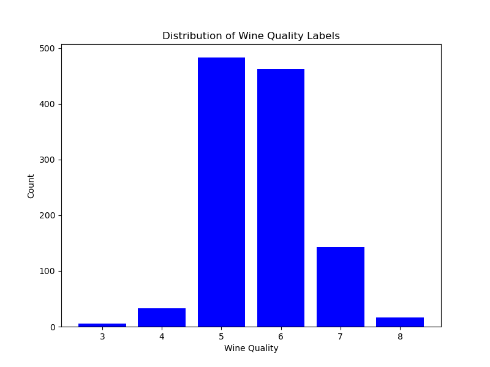
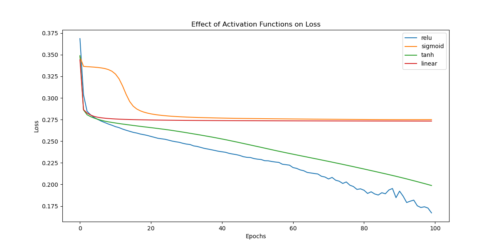
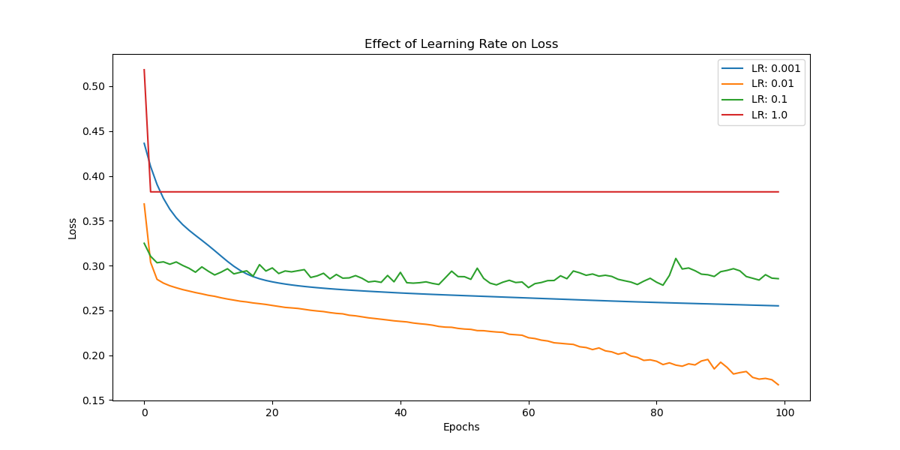
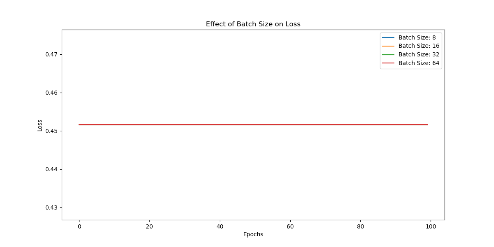
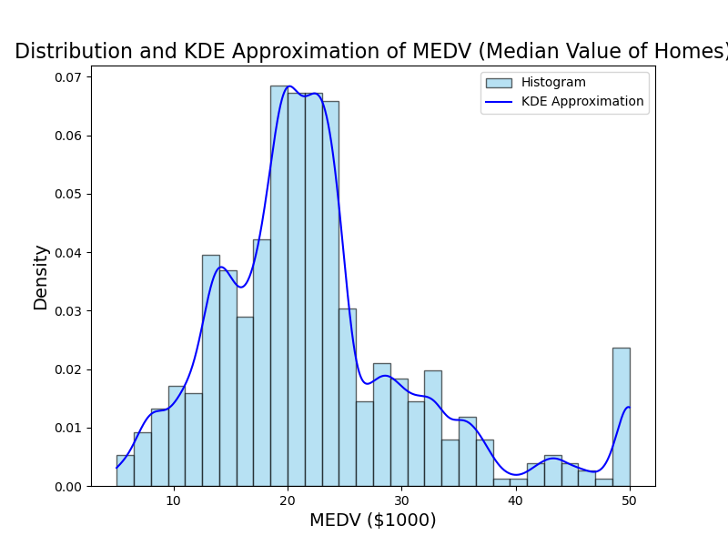
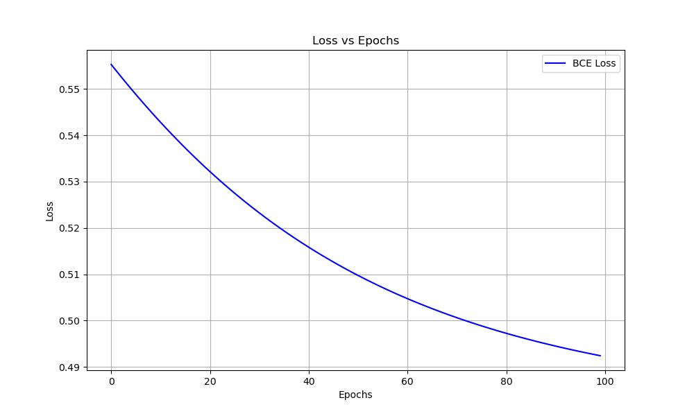
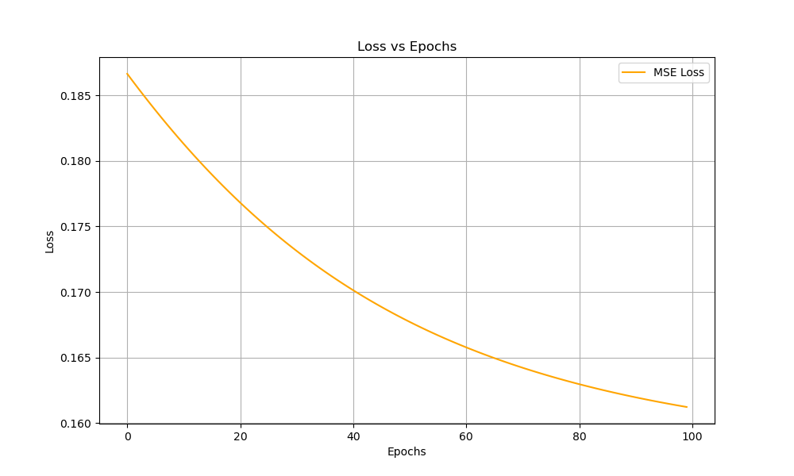

# 2
## 2.1

### Description of dataset:
| Feature                | Mean       | Standard Deviation | Min     | Max      |
|------------------------|------------|--------------------|---------|----------|
| Fixed Acidity           | 8.311111   | 1.747595           | 4.60000 | 15.90000 |
| Volatile Acidity        | 0.531339   | 0.179633           | 0.12000 | 1.58000  |
| Citric Acid             | 0.268364   | 0.196686           | 0.00000 | 1.00000  |
| Residual Sugar          | 2.532152   | 1.355917           | 0.90000 | 15.50000 |
| Chlorides               | 0.086933   | 0.047267           | 0.01200 | 0.61100  |
| Free Sulfur Dioxide     | 15.615486  | 10.250486          | 1.00000 | 68.00000 |
| Total Sulfur Dioxide    | 45.914698  | 32.782130          | 6.00000 | 289.00000|
| Density                 | 0.996730   | 0.001925           | 0.99007 | 1.00369  |
| pH                      | 3.311015   | 0.156664           | 2.74000 | 4.01000  |
| Sulphates               | 0.657708   | 0.170399           | 0.33000 | 2.00000  |
| Alcohol                 | 10.442111  | 1.082196           | 8.40000 | 14.90000 |
| Quality                 | 5.657043   | 0.805824           | 3.00000 | 8.00000  |
| Id                      | 804.969379 | 463.997116         | 0.00000 | 1597.00000|

### Distribution of labels across the entire dataset:

### 2.3

### 1 Plots:
https://wandb.ai/aditya_s_k-iiit-hyderabad/MLP-Classifier-Tuning/sweeps/7vz1j9jp?nw=nwuseraditya_s_k

### 2 Table:
https://wandb.ai/aditya_s_k-iiit-hyderabad/MLP-Classifier-Tuning/sweeps/7vz1j9jp/table

### 3 Parameters for best model:

activation = relu  
epochs = 100
hidden layers = [20,19]  
learning rate = 0.01   
optmizer = sgd   
early_stopping = True

## 2.4

### 1 Following results obtained on test set:

Test Accuracy: 0.5391   
Test Macro Precision: 0.4688  
Test Macro Recall: 0.4070  
Test Macro F1 Score: 0.4323  
Test Micro Precision: 0.5391  
Test Micro Recall: 0.5391  
Test Micro F1 Score: 0.5391  

## 2.5

### 1. Effect of Non-linearity:

It is observed that non-linaerity causes slow model convergence. We can see for linear activation we see that loss reduced a bit only in beginnig and then it is almost consatnt. It means model converges very fast. But for this convergence is not helpful it will not give good performance. But non-linear activation cause slow convergence but it results in better performance giving weights and biases.

### 2. Effect of Learning Rate:

From above plot I observe that model converges very fast when learning rate is high. But again this fast convergence doesn't give good performance giving weights and biases. On the other and low learning rate causes slow convergence but better performance giving weights and biases.

### 3. Effect of Batch Size:

In my case all the batch size have non-varying losses across all epochs. It means model converged in first epoch only. This indicates no effect of batch size on model convergence. This may have happened because the selected random seed is initializing weights and biases perfectly. 

## 2.7

Model did really well at class 2 that is wine quality = 2. I think the reason behind this is there are many inputs which have wine quality = 2 as there ground truth this is why model learned this class really well. But it does very bad for class 1 that is wine quality = 1 because there are very few input which have quaity = 1as there ground truth. So model was unable to learn the pattern for this class.

# 3

## 3.1

### 1 Dataset description:

| Feature   | Mean       | Standard Deviation | Min       | Max      |
|-----------|------------|--------------------|-----------|----------|
| CRIM      | 3.611874   | 8.720192           | 0.00632   | 88.9762  |
| ZN        | 11.211934  | 23.388876          | 0.00000   | 100.0000 |
| INDUS     | 11.083992  | 6.835896           | 0.46000   | 27.7400  |
| CHAS      | 0.069959   | 0.255340           | 0.00000   | 1.0000   |
| NOX       | 0.554695   | 0.115878           | 0.38500   | 0.8710   |
| RM        | 6.284634   | 0.702617           | 3.56100   | 8.7800   |
| AGE       | 68.518519  | 27.999513          | 2.90000   | 100.0000 |
| DIS       | 3.795043   | 2.105710           | 1.12960   | 12.1265  |
| RAD       | 9.549407   | 8.707259           | 1.00000   | 24.0000  |
| TAX       | 408.237154 | 168.537116         | 187.00000 | 711.0000 |
| PTRATIO   | 18.455534  | 2.164946           | 12.60000  | 22.0000  |
| B         | 356.674032 | 91.294864          | 0.32000   | 396.9000 |
| LSTAT     | 12.715432  | 7.155871           | 1.73000   | 37.9700  |
| MEDV      | 22.532806  | 9.197104           | 5.00000   | 50.0000  |

### 2 Distribution of the various labels across the entire dataset:

## 3.3

### 1 Plots:
https://wandb.ai/aditya_s_k-iiit-hyderabad/MLP-Regression-Tuning/sweeps/ug5o06yj?nw=nwuseraditya_s_k

### 2 Table:
https://wandb.ai/aditya_s_k-iiit-hyderabad/MLP-Regression-Tuning/sweeps/ug5o06yj/table

### Parameters for best model:

activation = relu  
epochs = 100
hidden layers = [60, 60, 50, 50, 40, 40, 30, 30] 
learning rate = 0.001   
optmizer = sgd   
early_stopping = True

## 3.4

Test MSE: 27.55352941176471
Test RMSE: 5.249145588737725
Test MAE: 2.7470588235294118
Test R-suared: 0.6932747714071621

Model performed less accurate on test set as compared to train and val set.

## 3.5

### 2 PLots

### BCE plot:

### MSE plot:

### 3 Observatins on plot:
Both the plots follow similar convergence. But the difference is BCE has high loss values than that of MSE. BCE varies between range  0.49 to 0.55 and MSE varies between 0.16 to 0.185.

## 3.6
Looking at the MSE Loss for each datapoint shows some clear trends. The model does worse on unusual data points that are very different from most others. It also struggles in areas where there isn't much training data. On the flip side, it does well with common cases and in areas where it has seen lots of similar examples before. These patterns show where the model is strong and where it needs work. To make it better, we could gather more data for the tricky areas or try different ways to handle unusual cases

# 4

# AutoEncoders:

## 4.3

### 2.

### Assignment 1 results:

k = 1 and distance metric = manhattan 

Validation Accuracy for k=1, distance_metric=manhattan: 0.3111

Validation Macro Precision: 0.3030

Validation Macro Recall: 0.3019

Validation Macro F1 Score: 0.3002

Validation Micro Precision: 0.3111

Validation Micro Recall: 0.3111

Validation Micro F1 Score: 0.3111

### Assignemnt 2 reslts on PCA reduced dataset:

k = 1 and distance metric = manhattan

Validation Accuracy for k=1, distance_metric=manhattan: 0.2707

Validation Macro Precision: 0.2674

Validation Macro Recall: 0.2665

Validation Macro F1 Score: 0.2652

Validation Micro Precision: 0.2707

Validation Micro Recall: 0.2707

Validation Micro F1 Score: 0.2707       

### Assignemnt 3 reslts on AutoEncoder reduced dataset:

k = 1 and distance metric = manhattan     

Validation Accuracy for k=1, distance_metric=manhattan: 0.1271    

Validation Macro Precision: 0.1316    

Validation Macro Recall: 0.1346     

Validation Macro F1 Score: 0.1321    

Validation Micro Precision: 0.1271    

Validation Micro Recall: 0.1271    

Validation Micro F1 Score: 0.1271    

### Analysis:

Assignment 1 results are best, then second good is Assignemnt 2 results that is on PCA reduced dataset, Assignment 3 that is Autoencoder reduced dataset results are worst.  All the metrics accuracy, precision, recall and f1-scores are higher in assignment 1 results than on PCA reduced dataset which ae higher than Autoencoder reduced dataset. This was quite not expected as we know autoencoders perform better than PCA generally. But here we don't get to see it. The possible reason might be, I am training autoencoder by specifying number of hidden layers, number of neurons, learning rate, etc. all the parameters based on results observed in hyperparameter tuning of regression class. But here it seems that the best parameters in regression are not giving bes result in autoencoder. To get the best results using autoencoder we need to do separate hyperparameter tuning. But without those best set of parameters we are unable to capture the variance in dataset using autoencoder. 

## 4.4

### My MLP Classifier class gives following results:

Validation Accuracy: 0.0111  

Validation Macro Precision: 0.0181  

Validation Macro Recall: 0.0107  

Validation Macro F1 Score: 0.0063  

Validation Micro Precision: 0.0111  

Validation Micro Recall: 0.0111  

Validation Micro F1 Score: 0.0111  

These are poor results as compared to all other above results. The reason for such poor results is again I think wrong choice of hyperparameters. Since there are may possible hyperparameters and some of the combinations will give good results and some give bad. So, to figure out those set of hyperparameters which will give good results we need to perform hyperparameter tuning. Also the need for this is more on this datraset as we can observe even if above results are better than this one, overall these relsults are porr only considering a classification task getting 0.3111 as highest accuracy is not a good thing. So for good relts this dataset needs more analysis, and corrections in various ways to classify it correctly.