# 2 KDE

## 2.3
       
### GMM Density Estimate 2 components
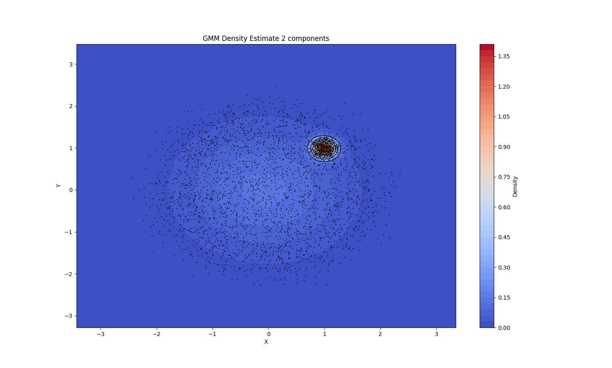

When we use 2 components for the GMM I observe that it considers the bigger citlcle of points with 3000 samples as one gaussian and smaller circle with 500 samples as another gaussian. This is quite expected and matches with the density estimation by KDE.

### GMM Density Estimate 5 components
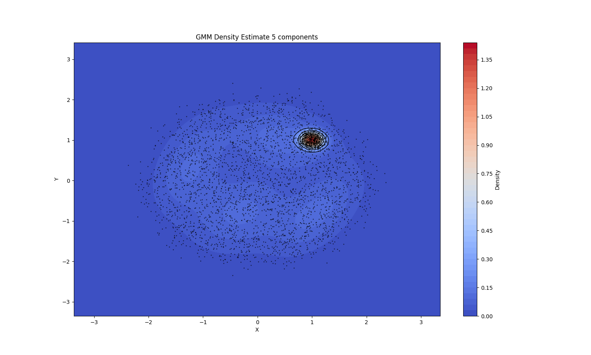 

### GMM Density Estimate 10 components
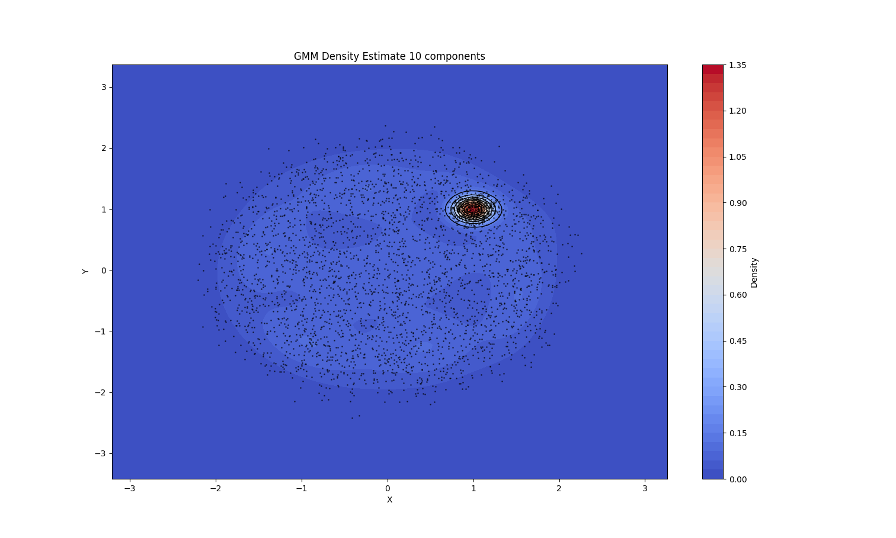

As the number of components increase the GMM model creates gaussian which are quite unnecessary which results in a bit irregular density estimation in uniform density area as well. But still it consistently gives expected density estimation for smaller circle which has 500 samples. 

### Gaussian Kernel Density Estimate:
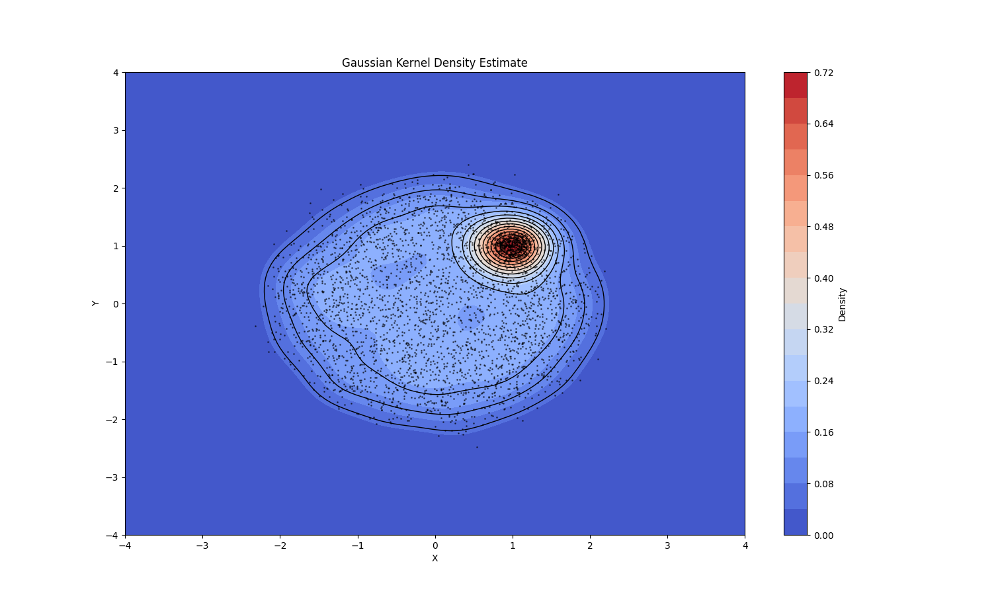

Considering above Gaussian Kernel Density Estimate using KDE, it is consistent within plot.  That is is correctly estimate densities where there is uniform density and wherever is change in density is there. It has better results than GMM density estimation.

### Gaussian Kernel Density Estimate:
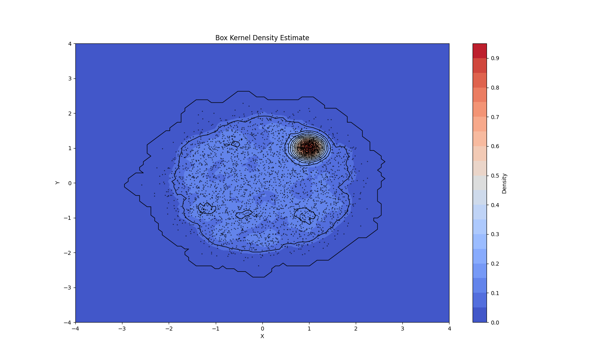

### Triangular Kernel Density Estimate:
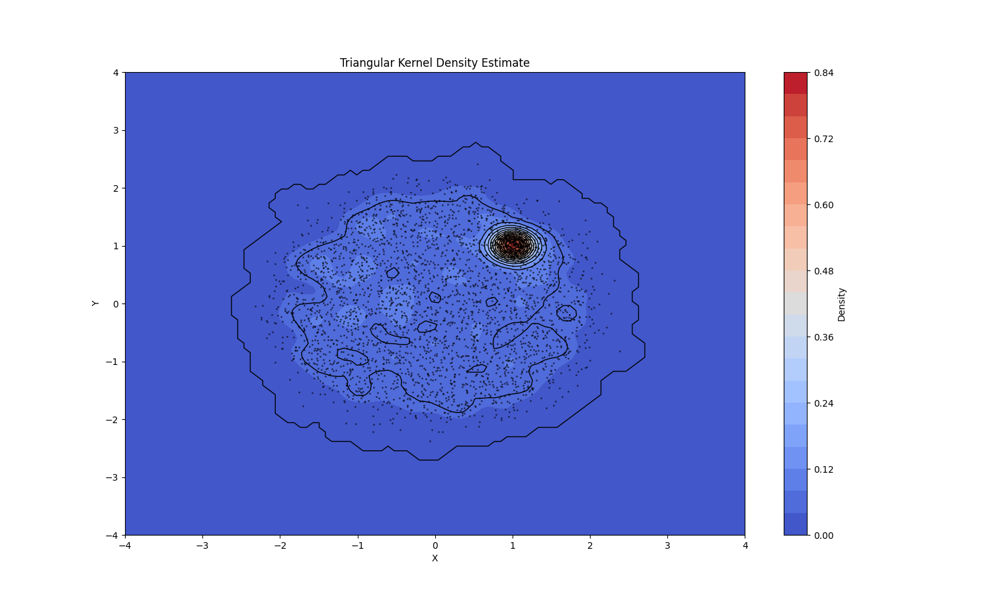

Above 2 plots show that box and triangular kernels have low performance as comapred to the gaussian kernel estimate. But still it is quite good overall. 
Also looking at three different kernel outputs in KDE we can say considering the factor of kernel the KDE model is not that consistent as the kernel changes the results also vary significantly. But KDE is model we can say is consistent within model

If we compare GMM and KDE then KDE is quite more consistent in its results also it doesn't need any parameter such as number of components as needed in GMM. This makes KDE to be better at density estimation as compared to GMM. But difference in results of both is not so high even GMM ouputs are very much acceptable.

# 3 HMM

## 3.2

### Following are some of the mfcc visualizations:   

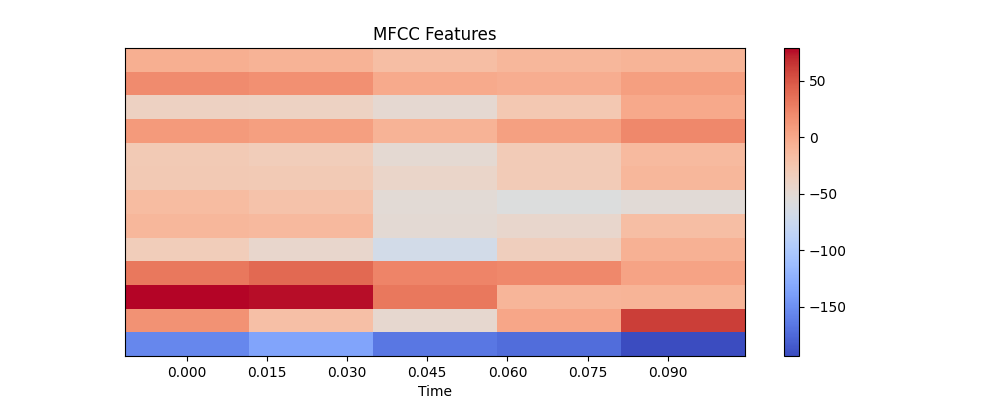
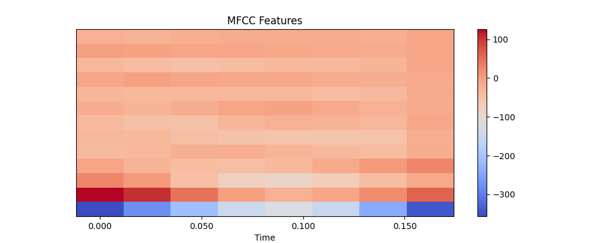
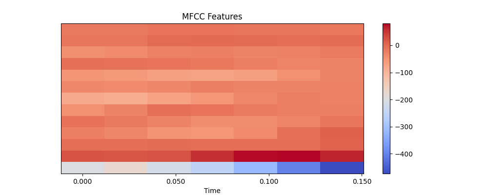
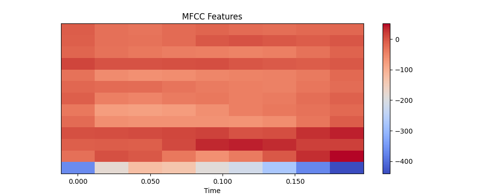
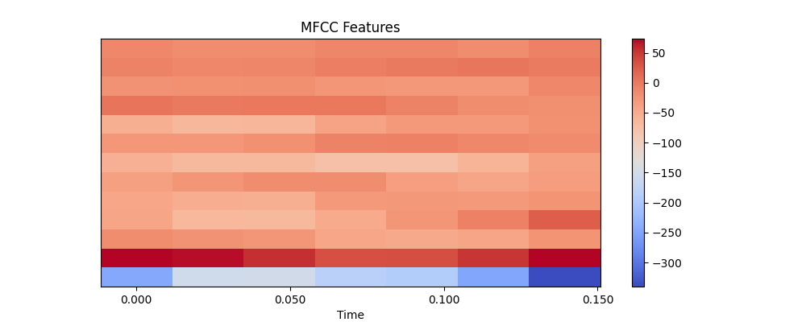
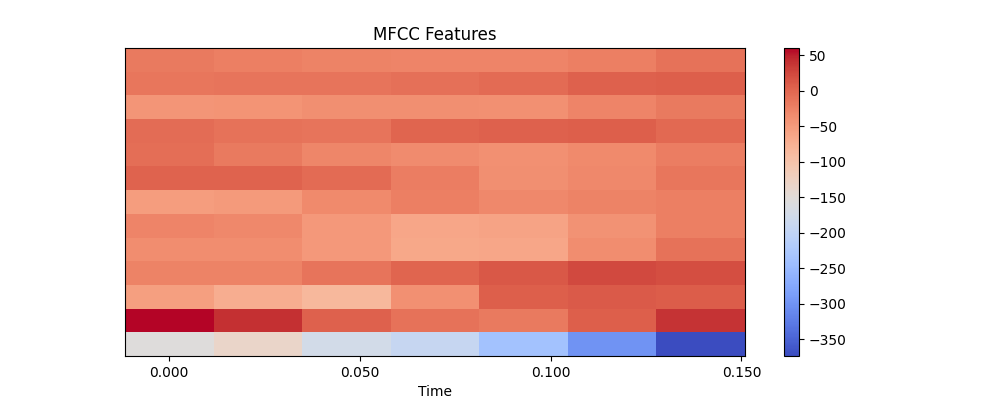

### Patterns in MFCC visualizations:

- State Transitions: Clear blocks of colors (red/blue) changing over time, especially visible in bottom rows
- Time Dependency: Features show consistent left-to-right progression with stable color bands
- Observable Features: Varying intensities represent different acoustic characteristics

These patterns make HMMs suitable because they can model both hidden vocal states and their observable MFCC features through probabilistic transitions, matching speech's sequential nature.
### Why HMM is Suitable:

- The speech patterns show hidden states (vocal configurations) producing observable features (MFCCs)
- The sequential nature of the patterns matches HMM's Markov property
- Natural variations in speech are handled by HMM's probabilistic transitions between states

These patterns make HMMs particularly effective for speech recognition as they can capture both the temporal dynamics and the probabilistic nature of speech signals.

## 3.4

### Comparison between performance on known and personal recordings:

Accuracy on test set: 93.33%  
Accuracy on my recordings: 10.00%

It is clear that model performs much better on given test set than personal recordings. The reason could be that the given recordings are divided in train and test set, so both have similar recordings. But personal recordings are very much different from the recordings given. Also the test dataset has bigger size it may happen that if more persoanl recordings are used to evaluate model then performance will increase. 

# 4 RNN

## 4.1

### 4.1.1

#### Examples of datapoints:

seq: [0 0 0 0 0 1 1], label: 2  
seq: [0 0 0 1 0], label: 1  
seq: [1 0 1 1 1 0 1 1 1 0 1 1], label: 9  
seq: [1 1 1 0 1 0 1 1 0 1 0 0], label: 7  
seq: [1 1 1], label: 3  
seq: [0 0 1 0 0 1 0 0 0 1 0 0 1], label: 4    
seq: [1 1 0 1], label: 3  
seq: [1 1 1 1 1 0 0 1 1], label: 7  
seq: [0 1 1 0 0 0 0 1], label: 3  
seq: [1 0 0 0], label: 1  

### During training losses(MAE) plot:
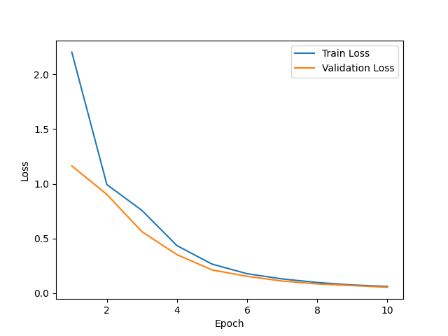

Losses decreases as expected.

### MAE plot as stated:  

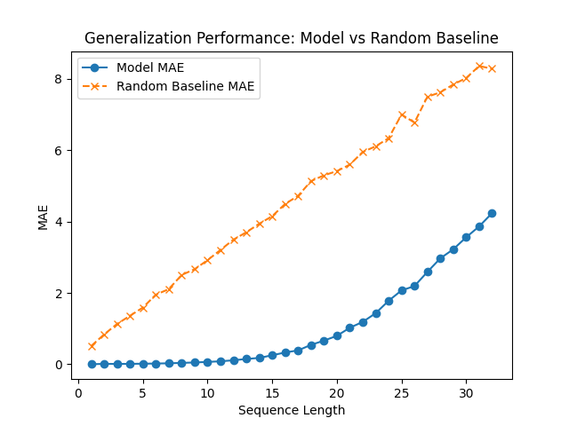

The plot for our model has almost 0 moss till sequence length is 16 above that it increases as the sequence length increases. This is because out model is trained on sequence lengths 1-16. Also our model perfroms better than random guessing for every sequeunce length.   
The plot for random guessing is almost constantly increasing and has loss much greater than trained model. The loss increases with increased sequence length because the possible answers(n+1 for sequence length n) increase with sequence length so probabilistically it is easy to guess an answer randomly for smaller sequence length. 